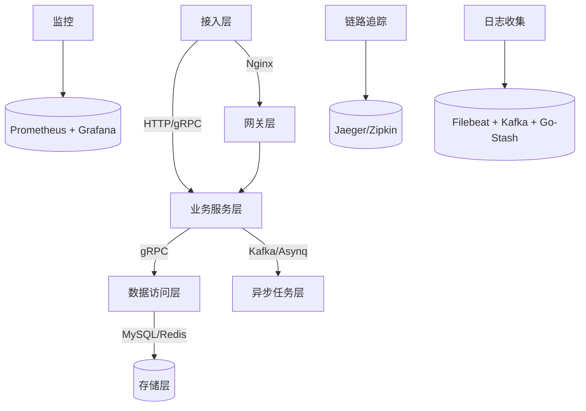
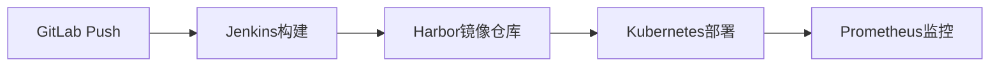

# 解释这个项目
<think>
好的，用户让我解释这个项目。我需要先回顾一下之前提供的项目信息和目录结构。

首先，项目名称是go-zero-looklook，是一个基于go-zero框架的微服务示例项目。用户可能想了解它的整体架构、技术栈、主要功能以及如何运作。

根据项目介绍，这个项目旨在帮助开发者快速上手go-zero，解决微服务开发中的常见问题，比如日志收集、监控、链路追踪、消息队列和分布式事务等。系统功能包括微服务架构、微信小程序登录支付、日志收集分析、服务监控等。

接下来，我需要整理这些信息，用中文简明扼要地解释项目的各个部分。要确保覆盖项目背景、架构模式、技术选型、目录结构以及部署流程。同时，注意不要使用Markdown格式，保持口语化的自然表达。

可能需要分点说明，比如项目概述、架构模式、技术栈、目录结构等。还要注意用户可能对某些术语不熟悉，需要适当解释，比如go-zero框架、Docker Compose、Kubernetes等。

另外，用户提供的目录结构显示有app、common、deploy等主要目录，每个目录下有不同的服务和组件，需要简要说明这些目录的作用和包含的内容。

最后，确保回答符合用户的需求，即全面了解该项目的基本情况和关键点，帮助用户快速掌握项目的核心要素。
</think>
这是一个基于Go语言的微服务项目示例，采用go-zero框架构建，主要面向希望快速掌握微服务开发的开发者。项目完整实现了微信小程序授权登录、支付功能，并集成了日志收集、监控、链路追踪等微服务必备组件。

核心架构采用API+RPC+MQ的分层模式：
- 前端通过微信小程序接入
- Nginx作为网关路由请求
- 业务层包含订单(order)、支付(payment)、民宿(travel)、用户中心(usercenter)四大服务
- 消息队列使用Kafka和Asynq处理异步任务
- 日志收集链路为Filebeat->Kafka->Go-Stash->Elasticsearch
- 监控体系采用Prometheus+Grafana
- 链路追踪支持Jaeger/Zipkin

关键技术栈包括：
- 微服务框架：go-zero v1.4.2 + gRPC
- 容器化：Docker Compose（开发环境） + Kubernetes（生产）
- 分布式事务：DTM（待集成）
- 数据库：MySQL 8.0 + Redis
- 开发工具：modd热加载、goctl代码生成

项目目录结构清晰划分业务模块：
- app目录下按业务划分微服务
- common目录包含通用组件（上下文、工具类、中间件等）
- deploy目录集中管理部署配置
- doc目录提供中英文技术文档
- 通过Makefile统一管理服务启停

该项目完整演示了微服务开发的最佳实践，包含从环境搭建、代码生成、服务部署到监控告警的完整流程，适合用作企业级微服务项目的参考模板。


# 快速入手
> 现在我刚接手这个项目, 请帮我快速梳理这个项目, 以便我能快速上手


# 具体模块
> 展开说说具体有哪些功能模块, 核心功能是啥, 关键点是啥, 帮我快速的梳理这个项目, 然后运行起来,

<think>
好的，我需要帮助用户快速梳理go-zero-looklook项目，明确其功能模块、核心功能、关键点，并指导如何运行起来。首先，我需要回顾用户提供的项目信息和之前的对话内容。

用户提到这是一个基于Go的微服务项目，使用go-zero框架，包含订单、支付、民宿、用户中心等服务，以及日志收集、监控、链路追踪等功能。用户现在想更详细地了解具体功能模块、核心功能、关键点，并运行项目。

首先，功能模块方面，项目分为app、common、deploy等目录。app下有order、payment、travel、usercenter和mqueue五个服务，每个服务包含API、RPC和MQ组件。common是通用组件，deploy是部署配置。需要详细列出每个模块的功能。

核心功能可能包括用户服务、民宿服务、订单处理、支付集成、消息队列、日志收集、监控和链路追踪。需要确认这些是否正确，并明确每个功能的关键技术。

关键点可能涉及技术栈的选择（如go-zero、gRPC）、架构模式（微服务、事件驱动）、部署方式（Docker Compose和Kubernetes）、热加载、错误处理等。需要从项目介绍中提取这些关键点。

运行项目方面，用户之前提到需要安装Docker、Docker Compose、Go 1.17，使用make up启动服务。需要详细步骤，包括安装依赖、初始化数据库、启动服务等。

需要检查是否有遗漏的信息，比如数据库初始化步骤，是否需要额外配置，比如环境变量或配置文件。同时，注意项目可能的已知问题，如DTM未集成，可能影响某些功能。

用户可能希望快速上手，所以需要简洁明确的步骤，避免复杂配置。可能需要提醒用户注意版本要求，如Go 1.17，go-zero版本等。

最后，确保回答符合用户提供的项目信息，不添加未提及的内容，确保准确性和相关
</think>

---

### 一、功能模块与核心功能

#### 1. **业务模块**
| 模块名称        | 核心功能                                                                 | 技术实现                                                                 |
|-----------------|--------------------------------------------------------------------------|--------------------------------------------------------------------------|
| **用户中心**    | 用户注册/登录、微信授权、身份验证                                       | JWT鉴权、MySQL存储、Redis缓存                                           |
| **民宿服务**    | 民宿信息管理、评论系统、活动推荐、商家管理                             | MySQL存储、Elasticsearch搜索、Redis缓存                                 |
| **订单服务**    | 订单创建、状态管理（待支付/已支付/取消）、库存扣减                      | 本地事务与分布式事务（DTM未集成）、Kafka异步通知库存服务                 |
| **支付服务**    | 微信支付集成、第三方支付回调处理、支付状态同步                          | 微信支付SDK、Redis幂等性校验、MySQL事务                                 |
| **消息队列**    | 延迟任务（如订单超时取消）、定时任务调度                                | Kafka（go-queue）+ Redis（asynq）、定时任务使用cron表达式                |

#### 2. **基础设施模块**
| 模块名称        | 核心功能                                                                 | 技术实现                                                                 |
|-----------------|--------------------------------------------------------------------------|--------------------------------------------------------------------------|
| **日志收集**    | 全链路日志聚合、分析与存储                                              | Filebeat采集→Kafka缓冲→Go-Stash处理→Elasticsearch存储                     |
| **监控系统**    | 服务指标监控（QPS、响应时间、错误率）、告警                             | Prometheus拉取指标→Grafana可视化→告警规则配置                            |
| **链路追踪**    | 分布式请求链路追踪、性能瓶颈分析                                        | Jaeger/Zipkin集成至API+RPC调用链                                        |
| **部署体系**    | 开发环境快速启动、生产环境容器化部署                                    | Docker Compose（开发）+ Kubernetes（生产）+ Jenkins CI/CD流水线          |

---

### 二、项目关键设计点

#### 1. **技术选型亮点**
- **轻量级微服务架构**：放弃etcd/Nacos等复杂注册中心，通过Docker Compose静态配置服务发现。
- **高性能日志链路**：Go-Stash替代Logstash，降低JVM资源消耗。
- **双消息队列策略**：Kafka处理高吞吐场景（如日志），Asynq专注延迟任务（Redis驱动）。
- **热加载开发**：modd.conf实现代码修改自动重启服务，提升开发效率。

#### 2. **架构关键点**
- **API聚合服务**：API层直接聚合多个RPC服务数据，减少前端请求次数。
- **错误码统一**：xerr包定义全局错误码（如`ErrPayNotFound`），HTTP状态码与业务错误分离。
- **ID生成策略**：sonyflake生成分布式ID（时间+节点ID+序列号）。
- **安全设计**：JWT拦截器（common/middleware）统一鉴权，微信支付回调签名验证。

---

### 三、快速运行指南（开发环境）

#### 1. **前置依赖**
```bash
# 安装Go 1.17+（需与项目兼容性匹配）
brew install go@1.17

# 安装Docker与Docker Compose
brew install docker docker-compose

# 安装modd（热加载）
brew install cadmiumx/tap/modd
```

#### 2. **启动基础服务**
```bash
# 克隆项目（替换为实际仓库地址）
git clone https://github.com/yourname/go-zero-looklook.git
cd go-zero-looklook

# 启动MySQL/Redis/Kafka等依赖（定义在docker-compose.yml）
make up
```

#### 3. **初始化数据库**
```bash
# 导入SQL文件（需提前安装MySQL客户端）
mysql -h127.0.0.1 -uroot -p < deploy/sql/looklook_usercenter.sql
mysql -h127.0.0.1 -uroot -p < deploy/sql/looklook_order.sql
# ...依次导入其他模块SQL
```

#### 4. **运行核心服务**
```bash
# 启动用户中心服务（在单独终端窗口执行）
modd -f modd.conf -s usercenter

# 启动订单服务
modd -f modd.conf -s order

# 启动民宿服务
modd -f modd.conf -s travel

# 启动支付服务
modd -f modd.conf -s payment
```

#### 5. **验证服务状态**
```bash
# 检查服务日志（以用户中心为例）
tail -f logs/usercenter.log

# 调用API测试（需替换为实际接口）
curl http://localhost:8001/api/usercenter/login
```

---

### 四、核心验证点
1. **服务健康检查**  
   访问各服务`/metrics`接口（如`http://localhost:8001/metrics`）确认Prometheus指标输出。

2. **链路追踪测试**  
   调用API接口时添加`X-B3-Traceid`请求头，检查Jaeger是否记录完整调用链。

3. **消息队列验证**  
   触发订单创建操作后，观察Kafka topic（如`order_timeout`）是否生成延迟消息。

4. **日志收集验证**  
   在Elasticsearch中查询索引`go-stash-*`，确认日志数据是否正常写入。

> ⚠️ 注意事项：  
> 1. 微信支付需配置商户号与证书（参考`payment`模块配置）  
> 2. 生产部署需替换[docker-compose.yml](file:///Users/zp/go/src/my-go-study/zero-study/go-zero-looklook/docker-compose.yml)中的镜像地址为私有Harbor仓库  
> 3. 分布式事务（DTM）需额外部署dtm服务并修改配置


# 整个项目是一个微服务架构


<think>
好的，用户现在提到整个项目是一个微服务架构，我需要根据之前的对话历史和提供的记忆信息来回应。首先，用户之前已经询问过项目结构、功能模块、运行步骤等，现在他们可能想更深入理解微服务架构的具体实现。

我需要回顾之前提供的项目信息，特别是技术架构部分。项目使用go-zero框架，结合gRPC、Kafka、Prometheus等技术。用户可能希望了解微服务如何划分，各服务之间的交互，以及关键技术的选型原因。

需要确保回答涵盖架构模式、技术选型、设计模式以及运行流程。根据记忆中的项目规范，微服务分为API、RPC、MQ层，使用Docker Compose和Kubernetes部署。同时，需要注意提到的分层架构、热加载、错误处理等规范。

用户可能没有明确问及，但深层需求可能是如何维护和扩展这些微服务，或者如何处理服务间的通信和一致性。因此，回答中应强调服务划分依据、通信机制、中间件选择及开发运维工具链。

需要避免过于技术化的术语，保持解释清晰，结构分明，帮助用户快速掌握项目的核心架构特点。

</think>
该项目采用**分层微服务架构**，通过清晰的模块划分和中间件集成实现高可扩展性与可维护性。以下是核心架构解析：

---

### 一、**分层架构设计**


#### 1. **接入层**
- **API服务**：提供RESTful接口（如用户中心8001端口）
- **gRPC服务**：内部服务间通信（如订单服务9002端口）
- **网关**：Nginx统一处理路由、限流、SSL终止

#### 2. **业务服务层**
- **用户中心**：管理用户身份认证、权限控制
- **订单服务**：处理订单生命周期（创建→支付→完成→关闭）
- **支付服务**：对接微信支付、处理交易状态同步
- **民宿服务**：商品信息管理、评价系统

#### 3. **异步任务层**
- **Kafka**：高吞吐消息队列（如订单超时取消）
- **Asynq**：Redis驱动的延迟任务队列（如优惠券过期通知）

#### 4. **基础设施层**
- **日志收集**：Filebeat→Kafka→Go-Stash→Elasticsearch
- **监控**：Prometheus拉取指标→Grafana可视化
- **链路追踪**：Jaeger注入TraceID实现全链路跟踪

---

### 二、**关键中间件选型逻辑**

| 技术点         | 选型理由                                                                 | 替代方案对比                          |
|----------------|--------------------------------------------------------------------------|---------------------------------------|
| **服务通信**   | gRPC（高性能、跨语言） + HTTP API（外部接入）                             | REST+JSON（开发简单但性能低）          |
| **消息队列**   | Kafka（高吞吐） + Asynq（延迟任务）                                       | RabbitMQ（功能全但部署复杂）           |
| **日志链路**   | Go-Stash替代Logstash（Go语言编写，资源消耗低）                            | Fluentd（轻量但插件生态弱）            |
| **ID生成**     | Sonyflake（时间+节点ID+序列号，避免Snowflake的时钟回拨问题）              | UUID（无序，存储效率低）               |
| **热加载**     | modd（文件变化触发重建，无需重启服务）                                    | dlv调试（侵入式调试）                  |

---

### 三、**服务间通信模式**

#### 1. **同步通信**
- **场景**：订单创建时需校验用户余额
- **实现**：
  ```go
  // 用户服务定义gRPC接口
  func (u *UserCenter) CheckBalance(ctx context.Context, req *BalanceReq) (*BalanceResp, error) {
      // ...
  }

  // 订单服务调用
  userRpc.CheckBalance(&BalanceReq{UserId: userId})
  ```

#### 2. **异步通信**
- **场景**：订单支付成功后触发库存扣减
- **实现**：
  ```go
  // 生产者（支付服务）
  producer := kafka.NewProducer("order_paid")
  producer.Send(&kafka.Message{Value: orderJson})

  // 消费者（库存服务）
  consumer := kafka.NewConsumer("order_paid")
  consumer.Subscribe(func(msg *kafka.Message) {
      UpdateInventory(msg.Value)
  })
  ```

---

### 四、**服务治理策略**

#### 1. **限流熔断**
- **实现**：在Nginx层配置限流规则
  ```nginx
  # 限制用户中心API每秒1000请求
  limit_req zone=one burst=5 nodelay;
  ```

#### 2. **配置管理**
- **环境变量注入**：数据库密码通过Docker环境变量配置
  ```yaml
  # docker-compose.yml
  environment:
    - DB_PASSWORD=${DB_PASSWORD}
  ```

#### 3. **灰度发布**
- **策略**：通过Kubernetes滚动更新逐步替换Pod
  ```bash
  kubectl set image deployment/order-api order-api:new-tag --rolling-update
  ```

---

### 五、**开发与部署流程**

#### 1. **本地开发**
- **热加载**：modd监听文件变化自动重启服务
  ```bash
  # modd.conf片段
  [usercenter]
  glob = app/usercenter/**/*.go
  cmd = go run app/usercenter/cmd/api/usercenter.go
  ```

#### 2. **CI/CD流程**


#### 3. **生产部署**
- **Kubernetes配置**：资源限制与自动扩缩容
  ```yaml
  resources:
    limits:
      cpu: "1"
      memory: 512Mi
  autoscaling:
    minReplicas: 2
    maxReplicas: 10
  ```

---

### 六、**典型调用链路示例**
以用户下单为例：
1. **前端请求**：`POST /order/create` → Nginx路由到订单API
2. **服务调用**：
   - 订单服务调用用户中心gRPC接口校验用户状态
   - 订单服务调用库存服务扣减库存（Kafka异步）
3. **日志追踪**：生成X-B3-TraceID贯穿所有服务
4. **异步处理**：订单超时未支付时Asynq触发状态更新

> ⚠️ 注意事项：  
> 1. 修改proto文件后需用`goctl`重新生成代码  
> 2. 涉及分布式事务（如库存扣减）需手动处理补偿逻辑（DTM未集成）  
> 3. 日志格式需统一使用`logx`包，便于Go-Stash解析